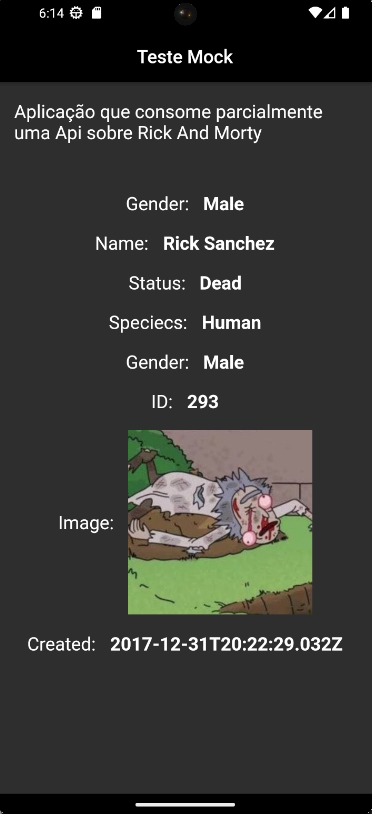

<h1 align="center">Teste Mock</h1>

<h3 align="center">✅ Concluído ✅</h3>

## 🎓 Sobre o projeto

Aplicação que consome uma API sobre [Rick and Morty](https://rickandmortyapi.com/api/character/293), para realizar testes de Mock
---
## 📚 Bibliotecas

As seguintes bibliotecas foram usadas na construção do projeto:

- **[Mockito](https://pub.dev/packages/mockito)**
- **[Http](https://pub.dev/packages/http)**
- **[Build Runner](https://pub.dev/packages/build_runner)**

> Veja o arquivo  **[pubspec.ymal](https://github.com/Pedro-Balestra/C214Lab_Atividade_TestMock/blob/main/pubspec.yaml)**

### Utilitários
- Editor:  **[Visual Studio Code](https://code.visualstudio.com/)**

[](https://pub.dev/)
---

## 🎨 Layout

<p align="center">
  

---
## ⚙️ Como executar o projeto

### 💡 Pré-requisitos

Antes de começar, você vai precisar ter instalado em sua máquina as seguintes ferramentas:
**[Git](https://git-scm.com)** e **[Flutter](https://docs.flutter.dev/get-started/install)**.<br> 

É necessário ter acesso a **[API](https://rickandmortyapi.com/api/character/293)** 

Recomendações:
* Um editor para trabalhar com o código como **[VSCode](https://code.visualstudio.com/)**
```bash

# Clone este repositório
$ git clone https://github.com/Pedro-Balestra/C214Lab_Atividade_TestMock.git

# Instale as dependências
$ flutter pub add --dev mockito
$ flutter pub add --dev build_runner
$ flutter pub add http

```
### ⚽ Rodando a aplicação

```bash

# Execute a aplicação
$ flutter run

```

### 🤖 Rodando os testes automatizados

```bash

# Execute os testes
$ flutter test

# Será mostrado um menu com as opções de teste

```

---

## 👥 Autor
<br>
**Pedro Balestra**


[](https://www.linkedin.com/in/pedro-balestra)
[](mailto:pedro.balestra@outlook.com)
---
## 📝 License
[](http://badges.mit-license.org)

- **[MIT license](https://choosealicense.com/licenses/mit/)**
